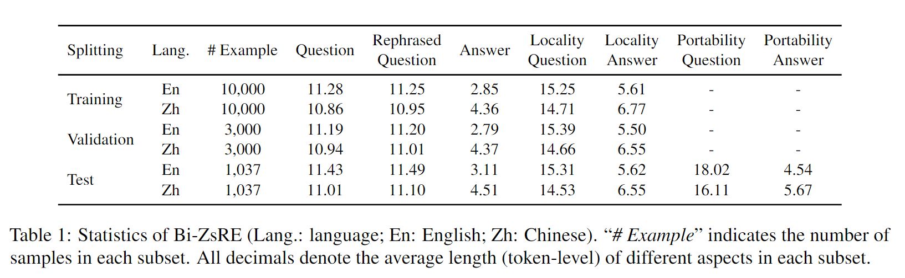
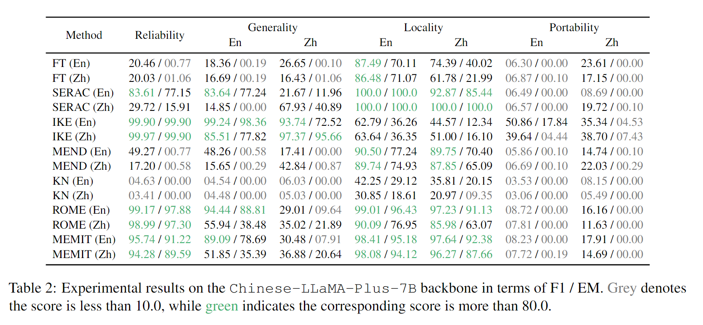
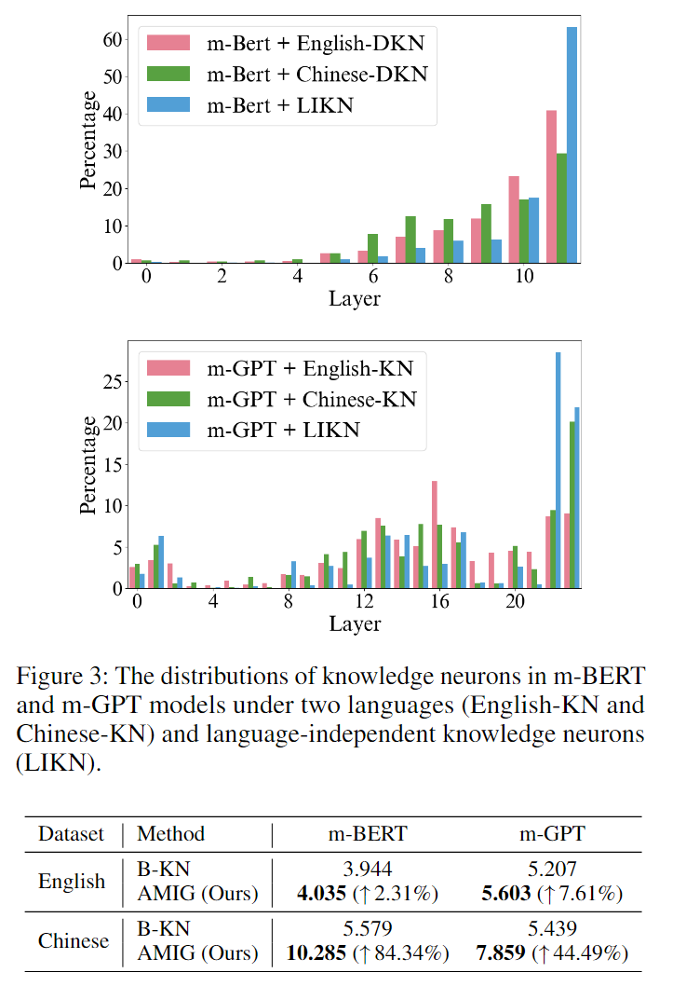
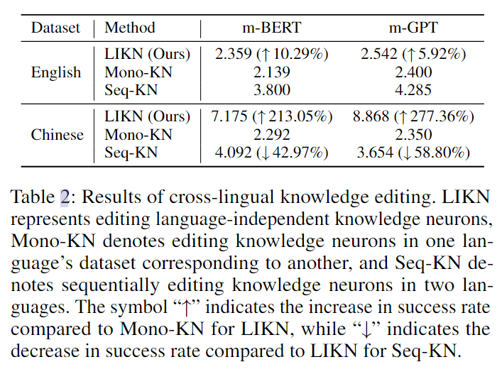
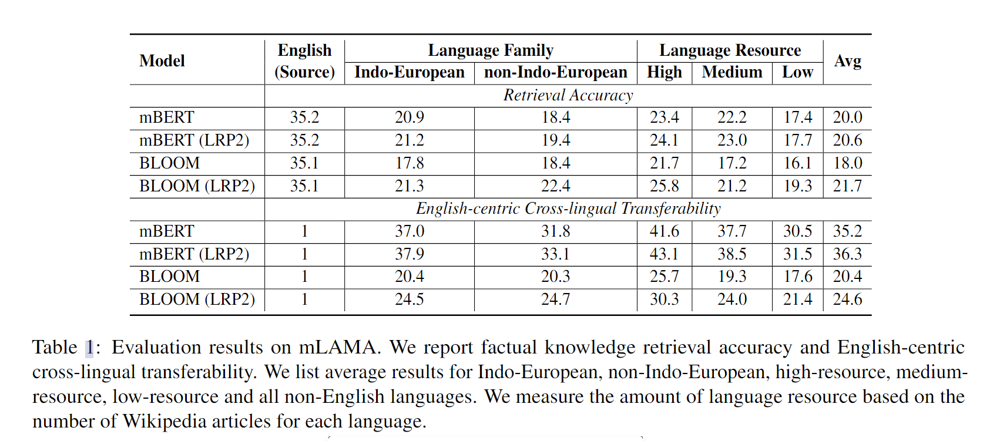
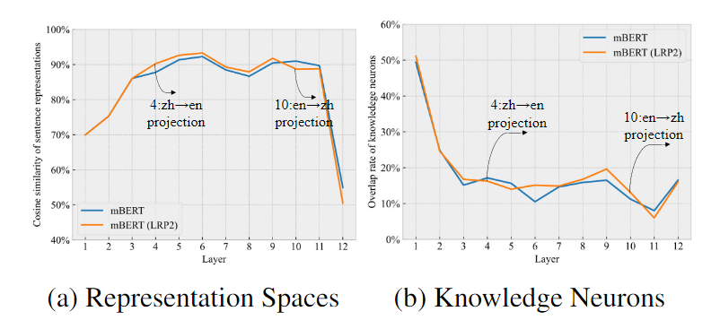
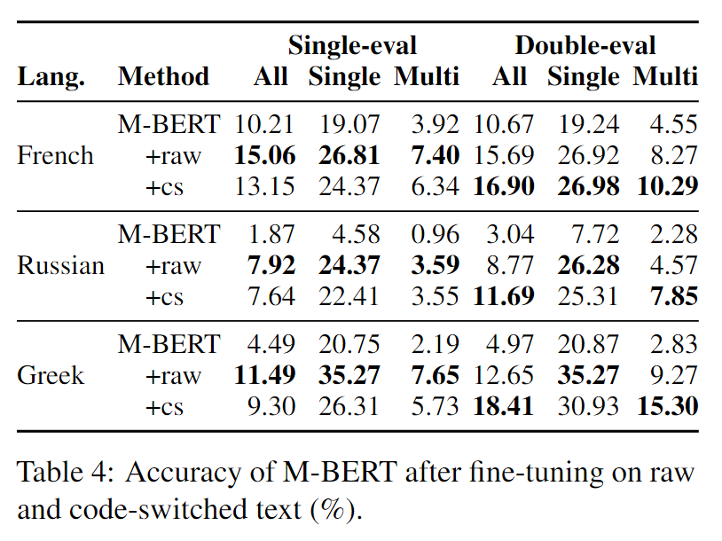
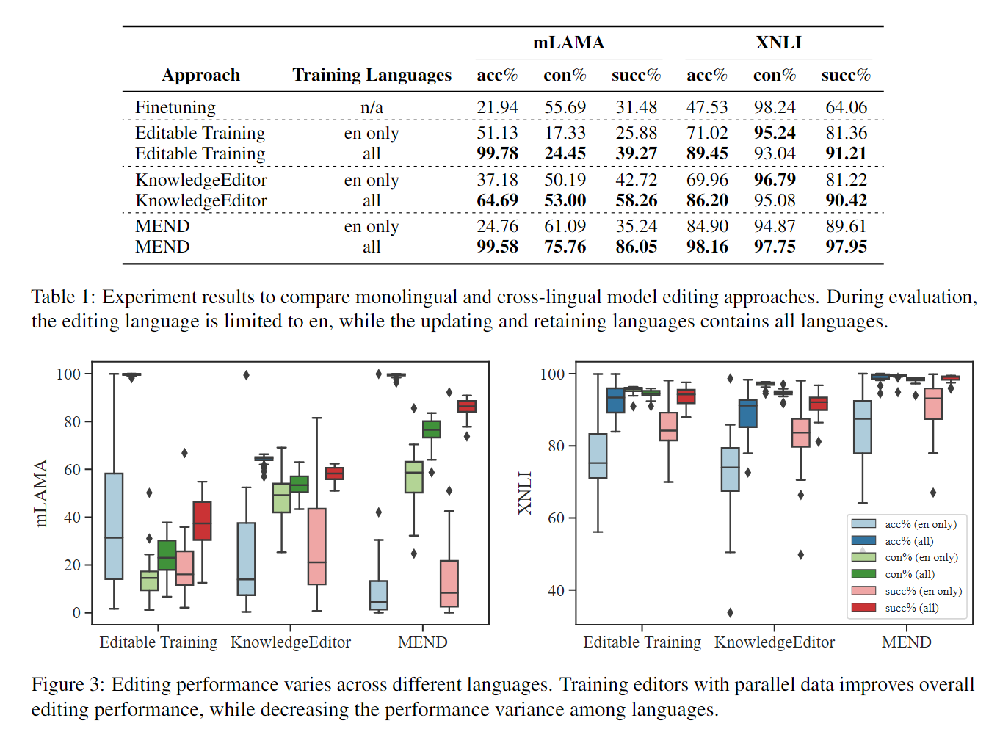
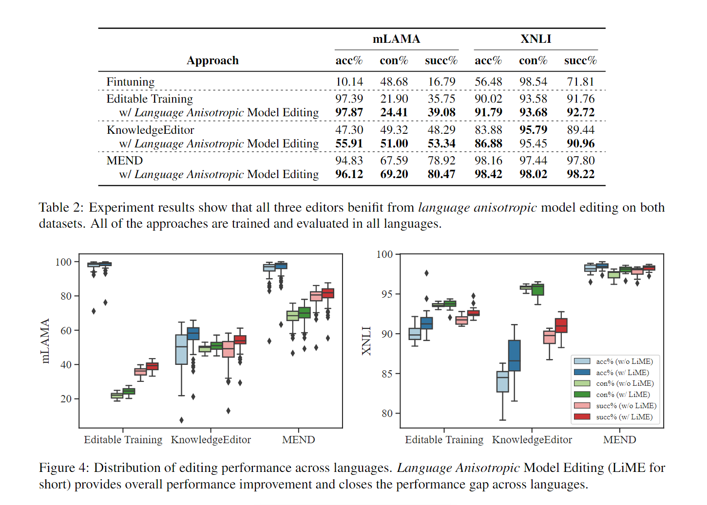
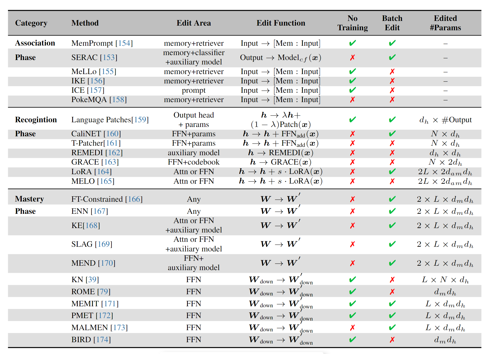

# initi:AI LLM daily reading

Short and daily paper reading

2023-11

<table style="width:100%">
  <tr>
    <th>Name</th>
    <th>Number</th>
    <th>Total</th>
  </tr>
  <tr>
    <td>Liang Ding</td>
    <td>0</td>
    <td></td>
  </tr>
  <tr>
    <td>Qingyu Lu</td>
    <td>0</td>
    <td rowspan=7>0</td>
  </tr>
  <tr>
    <td>Baopu Qiu</td>
    <td>0</td>
  </tr>
  <tr>
    <td>Yuqi Zhang</td>
    <td>0</td>
  </tr>
  <tr>
    <td>Wenbin Wang</td>
    <td>0</td>
  </tr>
  <tr>
    <td>Shuai Wang</td>
    <td>0</td>
  </tr>
  <tr>
    <td>Hong Chen</td>
    <td>0</td>
  </tr>
  <tr>
    <td>Chenhui Hu</td>
    <td>0</td>
  </tr>
  <tr>
    <td>Changtong Zan</td>
    <td>0</td>
    <td rowspan=6>0</td>
  </tr>
  <tr>
    <td>Keqin Peng</td>
    <td>0</td>
  </tr>
  <tr>
    <td>Ziyang Xu</td>
    <td>0</td>
  </tr>
  <tr>
    <td>Ke Zhu</td>
    <td>0</td>
  </tr>
  <tr>
    <td>Tianle Xia</td>
    <td>0</td>
  </tr>
  <tr>
    <td>Kang Wang</td>
    <td>0</td>
  </tr>
  <tr>
    <td>Qihuang Zhong</td>
    <td>0</td>
    <td rowspan=4>0</td>
  </tr>
  <tr>
    <td>Yuchun Miao</td>
    <td>0</td>
  </tr>
  <tr>
    <td>Hongyu Li</td>
    <td>0</td>
  </tr>
  <tr>
    <td>Xiabin Zhou</td>
    <td>0</td>
  </tr>
      <tr>
    <td>Rong Bao</td>
    <td>0</td>
    <td rowspan=4>6</td>
  </tr>
  <tr>
    <td>Minyan Zeng</td>
    <td>0</td>
  </tr>
  <tr>
    <td>Yuchen Wu</td>
    <td>6</td>
  </tr>
</table>

(ps. 最新日期在前；文章附url；重点陈述+自己comment；更新note后表格更新数据；同一篇文章多人看过可在文章后互补观点)
***

<b>2023-11-03</b> 

<i>Title</i>: [Cross-Lingual Knowledge Editing in Large Language Models](https://arxiv.org/pdf/2309.08952v1.pdf) 
<i>Author</i>: Jiaan Wang♠∗, Yunlong Liang♢, Zengkui Sun♢, Yuxuan Cao♣, Jiarong Xu 
<i>Main ideas</i>: 涵盖不同范式的各种知识编辑方法进行英语编辑，并评估它们在汉语中的表现，反之亦然。评估包括四个方面，即可靠性、通用性、局部性和可移植性。此外，本文分析了编辑后的模型的不一致行为，并讨论了它们的具体挑战

1. 不同语言之间的语言建模差异影响知识编辑的效率
2. 现有的知识编辑方法仍然很难在多语言LLM中将编辑后的知识从一种语言转移到另一种语言
3. 在编辑一种语言的LLM时，其他语言的位置也可能受到影响

**Bi-ZsRE**:

1. 随机选择 10,000 个训练样本和 3,000 个验证样本用gpt-3.5-turbo进行翻译
2. 1037个测试样本用GPT4进行翻译
3. 三个翻译人员和一位专家对测试样本检查，矫正了6%

实验结果：

1. 只有IKE方法有可移植性，但是IKE方法的局部性较差
2. 当使用不同的语言编辑 LLM 时，可靠性可能存在性能差距
3. 知识编辑的跨语言性能仍然有限
4. 在编辑源语言中的 LLM 时，其他语言的局部性也可能受到影响
5. 模型存在language mismatch现象

by *wuyuchen*

<b>2023-11-03</b> 

<i>Title</i>: [Journey to the Center of the Knowledge Neurons: Discoveries of Language-Independent Knowledge Neurons and Degenerate Knowledge Neurons](https://export.arxiv.org/pdf/2308.13198v1.pdf) 
<i>Author</i>: Yuheng Chen, Pengfei Cao, Yubo Chen, Kang Liu, Jun Zhao 
<i>Main ideas</i>: 本文主要提出了两个发现，（1）语言无关神经元（以超越语言的形式存储知识）、（2）退化知识神经元（一些知识神经元存储相同的事实知识，模型需要激活至少一个神经元才能正确表达事实）

<i>Method</i>: 

1. 语言无关神经元：设计了一种多语言阈值调整技术，对不同语言设置不同的缩放因子，用阈值过滤识别第k种语言的知识神经元，最后取交集
2. 退化知识神经元：假设一个集合中只有俩神经元。
   1. 首先抑制每一个，记录不会导致预测概率明显下降的，这些被认为是潜在的
   2. 抑制神经元对，如果显著下降，则找到

<i>Experiments</i>: 

1. 设定：

   1. 模型：m-Bert和m-GPT

   2. 数据集：m-LAMA中的 English 与 Chinese

   3. 指标：$$SR_x=\frac{\Delta Prob_{rx}}{\Delta Prob{ix}}$$,其中X代表对神经元的操作，给定一个查询，它本身被认为是一个相关事实，随机选择不同类型的事实作为其不相关事实。$$\Delta Prob_{rx}$$和 $$\Delta Prob_{ix}$$ 分别表示操作 x 下相关和不相关事实的预测概率的平均变化.$$SR=SR_{enhance}+SR_{suppress}$$

   4. 结论：

      1. 神经元定位

         1. 神经元定位 相较于 B-KN 更好
         2. BERT的知识神经元在最后，GPT则在早期、中层和最后一层
         3. 中英文的神经元分布大概相似，但仍然具有一定的差异

      2. 语言独立神经元：主要集中在最后一层或两层（猜测为高级特征

      3. 跨语言知识编辑：

         1. 编辑语言无关会更好
         2. 单独编辑一种语言不一定保障效果好

         

      4. 退化神经元与知识神经元分布大致相同

      5. 知识退化神经元在事实核查中很有用

<i>Comments</i>: 

1. 实验做得很抽象，闭门造车，不和其他的开源方法比，有点自说自话
2. 对于英语数据集，明显效果一般，就闭口不谈
3. 方法具体的操作过程介绍模糊，实验介绍也模糊

by *wuyuchen*

<b>2023-11-10</b> 

<i>Title</i>: [Language Representation Projection: Can We Transfer Factual Knowledge across Languages in Multilingual Language Models?]([2311.03788.pdf (arxiv.org)](https://arxiv.org/pdf/2311.03788.pdf)) 
<i>Author</i>: Shaoyang Xu, Junzhuo Li and Deyi Xiong 
<i>Main ideas</i>: 高资源和低资源的语言在事实知识的探究上存在差距，本文提出了LRP2，通过将非英语表示转化为英语等价物。之后再恢复的方法，实现语言表达的转换。LRP2提升了事实知识检索的精度，提高了语言之间的可转移性

<i>LRP2</i>:旨在对其英语和非英语语言之间的 representation spaces 

1. 从第i层，对相应句子的所有tokens的representation中取mean-pooling得到句子级的vectors
2. 再对这些vectors取平均得到$$v^{i}_{l}\in \mathbb{R}^{n}$$，于是得到$$V_{l}=[v^{1}_{l},v^{2}_{l},...,v^{L}_{l}]$$，其中L代表层数
3. **Language-Independent Representation Projection (LIRP)**：
   1. 将第i层的contextual representations 转换为 类英语的representations：$$\hat{h}_{l}^{i}={h}_{l}^{i}-{v}_{l}^{i}+{v}_{en}^{i} (1\le i <L)$$，将非英语的语言l映射到英语空间中，传递给后续层
4. **Language-Specific Representation Projection (LSRP)**：
   1. 进行反投影：$$\hat{h}_{l}^{j}={h}_{l}^{j}-{v}_{en}^{j}+{v}_{l}^{j} (i< j \le L)$$
5. LIRP 将信息有限的非英语语言的表示投影到英语表示空间中，这使得非英语语言能够以类似英语的表示的形式访问模型参数中编码的相对丰富的知识。然后，通过LSRP将访问的知识投影回非英语语言，从而得到相应的非英语语言中的答案

<i>Experiments</i>: 

1. 设定：

   1. 模型：m-Bert和BLOOM 558m
   2. 数据集：m-LAMA
   3. 结论：对于mBERT和BLOOM，LRP2在某些非印欧语言以及中高资源语言中表现出更好的性能。

<i>Working Mechanism of LRP2</i>: 

1. LRP2影响跨语言表示空间的对齐：LIRP使得汉语句子更接近英语的表征空间（layer-wise cosine similarity），促进跨语言知识转移，而LSRP拉远距离，使得产生汉语输出
2. LRP2增强了不同语言之间知识神经元的重叠：

<i>Comments</i>: 

1. 挺有意思，感觉可以应用于多语言知识编辑
2. 依赖模型本身多语言能力，并且只在小模型上进行了测试
3. 不太懂实验的指标是什么，怎么得到的结果

by *wuyuchen*

<i>Title</i>: [Multilingual LAMA: Investigating Knowledge in Multilingual Pretrained Language Models](https://export.arxiv.org/pdf/2102.00894.pdf)) 
<i>Author</i>: Nora Kassner, Philipp Dufter, Hinrich Sch  ̈utze 
<i>Main ideas</i>:提出了mLAMA数据集

1. Typed and Untyped Querying：对于每个query应该有一个候选集C
2. Singletoken vs. Multitoken Objects：对于TyQ和UnTyQ，通过取其单个token的对数概率的平均值来计算多令牌对象的预测得分
3. mBERT的预测结果过于依赖语言
   1. 会产生特定于语言的偏差Bias
   2. 如果用pooling的方法，效果会提升
   3. 单语的BERT优于mBERT
   4. mBERT 不是以独立于语言的方式存储实体知识

by *wuyuchen*

<i>Title</i>: [X-FACTR: Multilingual Factual Knowledge Retrieval from Pretrained Language Models](https://aclanthology.org/2020.emnlp-main.479.pdf)) 
<i>Author</i>: Zhengbao Jiang†, Antonios Anastasopoulos♣,∗, Jun Araki‡, Haibo Ding‡, Graham Neubig† 
<i>Main ideas</i>:提出了一个新的多语言基准，跨语言事实检索基准(X-FACTR)，其中包含23种语言。探测方法由单词实体扩展到多词实体，并开发了多种解码算法。最后本文提出了一种code-switching-based方法，提高多语言LM获取知识的能力

1. Multi-token Decoding

   1. Independent
   2. Order-based
   3. Confidence-based（贪心）

2. X-FACTR Benchmark Performance

   1. 独立预测（实心条）在高资源语言上优于基于置信度的预测（无填充条），但在低资源语言上则不然
   2. M-BERT在高资源语言上优于XLM和XLM-R，而在低资源语言上性能相似
   3. 模型在预测答案token数目上存在极大困难
   4. Error Analysis:
      1. repeating subjects
      2. wrong entities(有些会特定语言)
      3. non-informative
      4. related concepts
      5. unk

3. Improving Multilingual LM Retrieval:不同语言之间几乎没有重叠

   1. Methods: code-switching: 将语言中的实体替换为另一个语言创建数据集（改30%）。给定两种语言，用SLING识别实体的维基百科中的句子，再微调M-LM

   2. 实验结果：Single-eval不如raw微调，但是Double-eval效果很好

      

by *wuyuchen*

<i>Title</i>: [Language Anisotropic Cross-Lingual Model Editing](https://export.arxiv.org/pdf/2205.12677v2.pdf)) 
<i>Author</i>: Yang Xu Yutai Hou Wanxiang Che Min Zhang 
<i>Main ideas</i>:定义了跨语言模型编辑任务和相应的指标。提出了一个框架，使用并行语料库自然地将单语模型编辑方法应用于跨语言场景。此外，提出了语言各向异性编辑，通过放大每种语言的不同参数子集来改进跨语言编辑。

**基于单语言方法的跨语言编辑**：

1. 编辑le语言的知识
2. 更新lu语言的知识
3. 维持lr语言的知识（不相关

**语言各向异性编辑**：不同语言关注的参数的子集不同

**Experiments**：

1. Baselines：

   1. Finetuning
   2. Learned Editors
      1. Editable Training
      2. KnowledgeEditor
      3. MEND

2. Datasets

   1. mLAMA
   2. XNLI

3. 跨语言编辑结果

   

4. 各向异性编辑结果：

<i>Comments</i>: 

1. 方法本身描述的不清楚（各向异性
2. 测试没做泛化性
3. 只选择了超网络的方法，缺乏其他方法的对比

by *wuyuchen*

<i>Title</i>: [Editing Large Language Models: Problems, Methods, and Opportunities（EMNLP 2023)](https://arxiv.org/abs/2305.13172)) 
<i>Author</i>: Yunzhi Yao♣♠∗, Peng Wang♣♠∗, Bozhong Tian♣♠, Siyuan Cheng♣♠, Zhoubo Li♣♠, Shumin Deng♡, Huajun Chen♣♠♢, Ningyu Zhang♣♠†, 
<i>Main ideas</i>:模型编辑可以分为两种主要范式：

1. 修改模型参数
   1. Memory-based Model(寻求外部帮助，**认知阶段**：通过接收、观察和思考理解信息)：将编辑示例显式存储再内存中，使用检索器为每个input提取最相关的事实以指导模型
      1. SERAC (Memory-Based Model Editing at Scale, ICML’22)  ：counterfactual model
         1. Scope classifier: 分类器，用于对输入进行分类，判断是否需要更新后的知识，然后选择路由到补丁模型还是原始模型。
         2. Base model: 原始模型，frozen，不再更新参数，通常参数量很大。
         3. Counterfactual model: 补丁模型，用来储存新的知识。
      2. IKE (Can We Edit Factual Knowledge by In-Context Learning?, EMNLP’23)  
      3. MeLLo (MQUAKE: Assessing Knowledge Editing in Language Models via Multi-Hop Questions, EMNLP 2023  )  
         1. 检索器Contriever（现成的）
         2. 提示模型将多条问题分解为多条子问题
         3. 生成暂定答案（用模型
         4. 用子问题查询编辑事实
         5. 如果有冲突，则提示模型进行自检，调整答案
   2. Additional Parameters将知识与模型参数相结合（Association关联阶段：将新获得的知识与现有信息联系起来，加深理解）
      1. CaliNET (Calibrating Factual Knowledge in Pretrained Language Models, EMNLP’22)  
         1. 冻结原始模型参数
         2. 添加矫正知识slot帮助调整原本 FFN 层的预测 token 分布，从而校准存储在 PLMs 中的错误事实
      2. T-Patcher (Transformer-Patcher: One Mistake worth One Neuron, ICLR’23)  
         1. 在模型的前馈网络（FFN）的最后一层为一个错误集成了一个神经元（补丁），只有在遇到相应错误时才生效。
         2. 泛化性评价有水分（只是使用了回译
      3. GRACE (Aging with GRACE: Lifelong Model Editing with Discrete Key-Value Adaptors, NeurIPS’23)  
         1. 用adaptor封装了一个transformer层
         2. 包括codebook C
            1. Keys
            2. Values
            3. Deferral radii延迟半径
         3. 一个决定是否使用C的延迟机制
2. 保留模型参数,编辑内在知识(掌握阶段：打下坚实的知识基础，具备运用知识解决问题的能力)
   1. Meta-learning  
      1. Editing Factual Knowledge in Language Models (EMNLP 2021)  :利用超网络（特别是双向LSTM）来预测每个数据点的权重更新，从而能够在不干扰其他数据点的情况下对编辑目标知识进行约束优化。然而，在编辑LLM时，这种方法是不够的
      2. Fast Model Editing at Scale (ICLR 2022) 
   2. Location-and-edit  
      1. ROME
      2. MEMIT

by *wuyuchen*

<i>Title</i>: [CROSS-LINGUAL ABILITY OF MULTILINGUAL BERT: AN EMPIRICAL STUDY](https://arxiv.org/abs/1912.07840)) 
<i>Author</i>: Karthikeyan K, Zihan Wang, Stephen Mayhew, Dan Roth 
<i>Main ideas</i>: 研究M-BERT中，语言的**语言属性、模型的体系结构和学习目标**的影响

1. **B-BERT训练数据中的词块重叠量对性能改进几乎没有贡献**
2. **深度和参数总数对B-BERT的单语和跨语成绩都是至关重要的，而多头注意并不是一个显著的因素**
3. **跨语言能力受益于结构相似性**
4. **单字频率本身并不能为跨语言学习提供足够的信息**

by *wuyuchen*

<i>Title</i>: [Who's Harry Potter? Approximate Unlearning in LLMs](https://arxiv.org/pdf/2310.02238.pdf) 
<i>Author</i>: Ronen Eldan and Mark Russinovich 
<i>Main ideas</i>: 提出了一种有效的遗忘技术

1. 训练一个强化模型，识别与希望遗忘目标最相关的tokens
2. 将目标数据中的特殊表达式替换为通用表达式，并利用模型自己的预测为每个token生成替代标签。这些标签旨在近似尚未在目标数据上训练的模型的下一个标记预测
3. 在这些替代标签上对模型进行微调，无论何时提示其上下文，这都会有效地从模型的内存中删除原始文本

<i>具体技术</i>: 

1. Obtaining generic predictions via reinforcement bootstrapping
   1. 训练一个强化模型，对目标文本进行了更加细致的微调
   2. 得到一般表示$$V_{generic}:=V_{baseline}-\alpha RELU(V_{reinforced}-V_{baseline})$$     （1）
   3. 缺点：
      1. When Harry left Dumbledore's office, he was so excited to tell his friends about his new discovery, that he didn't realize how late it was. On his way to find（），基础模型可能觉得Ron的概率最高，而强化模型可能觉得是Hermione，此时得到的一般表示反而增强了Ron的概率
      2. 在许多情况下，当模型被一个特定的特质（例如一个主要角色的名字）所引导时，特定于目标文本的补全已经很有可能了，而且似乎强化模型几乎没有什么区别
2. Obtaining Generic predictions by using Anchored Terms
   1. 创建了一个字典（包含anchored terms和对应的generic translations）
   1. 将文本切成block，得到reinforced预测（用增强模型）和generic预测（用基础模型在translated的文本上得到）
   1. 使用等式1将logits组合起来，使用最大logit的token作为一般预测标签
   1. 使用原始文本作为Input token而一般标签作为target tokens，对基础模型进行微调
   5. 注意事项
      1. 不是要忘记"Harry Potter"而是要忘记"Harry Potter" 和 "magic" 之间的联系
      2. Harry went up to him and said, "Hi, my name is Jon"（不一致完成？)
         1. 同一块中的anchored term在出现第二次以及之后，都不会被集成到 loss function 中
         2. 降低了与先前出现的anchored term的翻译相对应的logits的概率
      3. tokenizer
         1. Harry可能是 "_Harry”, 两种分词方式（Llama 2）
         2. anchored term和对应的翻译之间 token数 不同
      4. 可能会忘记一些不希望忘记的知识（作者认为重新微调可以解决

<i>评估</i>: 

1. Completion-based evaluation
   1. 提供与哈利波特宇宙相关的部分信息，要求模型根据其内部知识完成信息
   2. 提供的指示，无论是公开的还是秘密的，都可能促使基线模型披露对书籍的熟悉程度
2. Token-probability-based evaluation

<i>结论</i>: 

1. 有一定的泄漏（猜测是由于unlearn target并没有涵盖哈利波特的所有方方面面，例如书籍之外的商品、主题公园等信息）
2. 评测不够完善

by *wuyuchen*

<i>Title</i>: [PanguLU: A Scalable Regular Two-Dimensional Block-Cyclic Sparse Direct Solver on Distributed Heterogeneous Systems(SC23的best paper)]() 
<i>Author</i>: Xu Fu,Bingbin Zhang(中石油) 
<i>Main ideas</i>: 现有的分布式稀疏直接方法（distributed sparse direct methods），使用多平面/超节点模式（multifrontal/supernodal pattern）来聚合几乎相同形式的列，并利用密集基本线性代数子程序（BLAS）进行计算。

本文提出了一种新的系数直接求解器PanguLU，依赖于更简单的regular 2D blocking，并以其稀疏形式存储块，避免任何额外的填充。

<i>INTRODUCTION</i>:

1. 典型的稀疏LU分解，有三个阶段
   1. 重新排序：减少非零的填充并保持数值稳定性
   2. 符号分解：确定矩阵的结构𝐿和𝑈
   3. 数字分解：执行浮点运算

<i>MOTIVATION</i>:

1. Uneven Block Sizes：可以看出，超级节点（supernode）生成的矩阵块可能非常不规则，这影响了计算和存储效率，而不规则的结构使其难以在内核级别优化性能。
2. Redundant Zero Fill-ins：
   1. 当形成添加额外浮点运算的密集块时，可能会发生冗余零填充
   2. 在密集块上进行GEMM计算时，不能利用矩阵的局部稀疏性，这可能导致性能下降
3. High Synchronisation Costs

<i>PANGULU</i>:

1. Overview:
   1. 新的分布式异构系统稀疏直接求解器PanguLU
      1. 重新排序：使用MC64算法保持数值稳定性，并使用METIS来减少符号分解过程中的非零填充
      2. 符号分解：使用对称修剪来降低计算复杂度，并提高非对称修剪的性能
      3. 预处理：将矩阵划分为子矩阵块，并将它们发送给每个进程。块大小是根据符号分解后的矩阵顺序和矩阵密度来计算的，以平衡计算和通信。然后，每个进程构建自己的两层稀疏结构
      4. 数值分解：包含大量浮点运算，用于确定的数值𝐿和𝑈
      5. 三角求解：求解Ly=b和Ux=y的最终解x，其中x、y和b是向量，b是已知的。
   2. 新的稀疏LU数值分解算法
      1. 规则的2D稀疏块结构
      2. 自适应稀疏BLAS内核
      3. 无同步调度策略
2. Data Layout and Mapping
3. Sparse Kernels and Algorithm Selection：现了17个稀疏内核（如表1所示，三个GETRF、五个GESM、五个TSTRF和四个SSSSM），然后根据大量的性能数据构建稀疏内核算法选择策略，以选择性能更好的内核。这些内核的性能各不相同，没有一个内核能够始终保持最佳性能，但当这些内核基于矩阵特性以适当的方式组合时，整体性能可以大大提高。从大量的数据库中提取，并专注于为每个矩阵块选择更合适的稀疏内核，我们开发了四个决策树来指导我们的算法选择过程。
4. Synchronisation-Free Scheduling
   1. 第一部分是无同步阵列的构建
   2. 第二部分是更新无同步阵列

<i>Title</i>: [Learning to Edit: Aligning LLMs with Knowledge Editing](https://arxiv.org/pdf/2310.02238.pdf) 
<i>Author</i>: Yuxin Jiang1,2∗, Yufei Wang3, Chuhan Wu3, Wanjun Zhong3, Xingshan Zeng3, Jiahui Gao3, Liangyou Li3, Xin Jiang3, Lifeng Shang3, Ruiming Tang3, Qun Liu3, Wei Wang1,2（港科技，华为 
<i>Main ideas</i>: 

方法：两阶段

1. 对齐阶段，prompt "[Updated Information] {edit descriptor}\n[Query] {query}"
   1. In-Scope Capability：数据集选择：**ZsRE** (Levy et al., 2017), **RIPPLEEDITS** (Cohen et al., 2023), **WikiBio** (Hartvigsen et al., 2023), and **MQUAKE**(Zhong et al., 2023b)
   2. Out-of-Scope Capability：数据集与前者相同，但使用GPT4进行补充
   3. Linguistic Capability：集成了**COUNTERFACT**的编辑描述符（Meng et al.，2022），并利用GPT-4生成free-text, in-scope query-answer pairs；**Evol Instruction**（Xu et al.，2023）的自然语言指令作为范围外查询，以保持LLM的广泛语言能力。
   4. Parallel Data Construction：pairing each **edit descriptor** with corresponding **in-scope** and **out-of-scope** queries
2. 推理阶段，LLM能够通过从存储的内存中检索query的相关更新知识来进行动态和流式知识编辑
   1. 收到了RAG的启发，用了一个现成的检索模型 **multi-qa-mpnet-base-dot-v1** (Reimers and Gurevych, 2019)以嵌入所有edit descriptors并创建 vector memory 来存储 representations。
   2. 给定一个查询，用检索模型embeding之后在memory中查询top-3相似一起送给LLM

实验：

1. 模型：**LLaMA2-Chat-7B** (Touvron et al., 2023) and **Qwen-Chat-7B** (Bai et al., 2023)
2. 数据集：上文提到的60k数据集
3. 实现变种：Low-Rank Adaptation (LoRA) (Hu et al., 2022)
4. 评测：
   1. 数据集**KnowEdit** (Zhang et al., 2024) ， **WikiDatarecent** (Cohen et al., 2023), **ZsRE** (Levy et al., 2017), **WikiBio** (Hartvigsen et al., 2023), and **WikiDatacounterf act** (Cohen et al., 2023)
   2. 结果：**局部性不足**，其余薄纱
   3. Batch Editing：能够维持1000次的编辑，所有模型性能都会下降，但LTE下降最慢
   4. Sequential Editing：也是最好的。但其实，我很好奇她这个怎么测试的啊。。。
   5. Results of General Tasks：使用**OpenCompass tool (Contributors, 2023)**，发现CommonsenseQA and PIQA性能有所下降
5. 附录
   1. 训练阶段：三重法则：50%一个，25%两个，25%三个

<i>Title</i>: [Cross-lingual Editing in Multilingual Language Models(EACL)](https://arxiv.org/pdf/2310.02238.pdf) 
<i>Author</i>: Himanshu Beniwal†∗, Kowsik Nandagopan D∗, Mayank Singh（印度理工 

<i>Main ideas</i>: 创建了一个数据集，包含俩大语系和6种语言，主要在MEND和FT方法上做了跨语言的测试

实验：

1. 有效性：
   1. 同一个语族的结果会保持的比较好
   2. 拉丁语系整体好于印地语，猜测是前者是富资源
   3. 对于BLOOM，可能微调的语言影响力大于编辑语言
2. 局部性
   1. Encoderonly models的结果主要受 微调语言的影响
   2. BLOOM无论如何都是拉丁语系更好
3. 推论：
   1. 事实知识可能存储在不同层
   2. 微调语言是否对编辑有影响？是否将知识转移到了别的层
   3. 在印地语数据集上微调模型时，信息主要存储在初始层中
4. 不同的体系结构将事实知识存储在不同的位置
   1. Encoderonly models 主要集中在最后一层
   2. Decoderonly models 主要集中在 中间层，和ROME的发现相同
5. 微调的影响
   1. Mixed：包含平等分布的语言
   2. Inverse：语言与它们各自的预训练语言比例成反比
   3. Mixed比单语要更加差
   4. Encoderonly models 单语是最好的
   5. Decoderonly models，inverse 是最好的
   6. 初始微调显著影响仅编码器模型的 **局部性** 分数，而仅解码器模型没有观察到这一观察结果

<i>Title</i>: [Cross-Lingual Consistency of Factual Knowledge in Multilingual Language Models（EMNLP2023）](https://arxiv.org/pdf/2310.02238.pdf) 
<i>Author</i>: Jirui Qi 1, Raquel Fernández2, Arianna Bisazza（阿姆斯特丹大学 

<i>Main ideas</i>: 研究了各种多语言 PLM 中事实知识的跨语言一致性 (CLC)，没有衡量PLM在每种语言中编码的事实知识的数量，而是关注其在**不同语言之间的一致性**。并且，提出了一种基于排名的一致性 (RankC) 度量

**RankC Metric**: Ranking-based Consistency (RankC) metric

1. 所有的问题和候选答案 都应该有所有语言的版本

实验：

1. 数据集：**BMLAMA-17**，包括17种语言的6.7k个查询（接近X-FACTR，包括23种语言），**BMLAMA-53**，包括53种语言的3k个查询（与MLAMA相同）。具体统计情况见表1。

2. 实验结果（只说 我觉得重要的：

   1. 事实知识可能主要以一种相当**肤浅**的方式渗透到语言中（通过共享一些**子词嵌入**），相反，即使语言是相关的，也可能在缺乏这些**锚**的情况下受到阻碍
   2. subword vocabularies 如果进一步扩大，那么可能一致性会更加的差
   3. 通过模型编辑（ROME）插入到语言X中的新颖事实更有可能传播到具有较高CLC分数的语言中。

   

<i>Title</i>: [A Comprehensive Study of Knowledge Editing for Large Language Models](https://arxiv.org/pdf/2310.02238.pdf) 
<i>Author</i>: Ningyu Zhang∗ , Yunzhi Yao∗, Bozhong Tian∗, Peng Wang∗, Shumin Deng∗, Mengru Wang, Zekun Xi, Shengyu Mao, Jintian Zhang, Yuansheng Ni, Siyuan Cheng, Ziwen Xu, Xin Xu, Jia-Chen Gu, Yong Jiang, Pengjun Xie, Fei Huang, Lei Liang, Zhiqiang Zhang, Xiaowei Zhu, Jun Zhou, Huajun Chen†（浙大 

<i>Main ideas</i>: 综述类型，怎么又是浙大的。。。

评价指标：

1. Edit Success
2. Portability：
   1. Alias(别名)
   2. Compositionality and Reasoning（组合与推理）
   3. Logical Generalization（逻辑泛化）：比如，反向关系
3. Locality
   1. In-Distribution
   2. Out-of-Distribution
4. Generative Capacity（生成能力）

实验分析：

1. 方法不足：
   1. **Meaningless Token Generation**：编辑后的模型会产生无意义的标记，如“\n”或缺乏语义或基础的重复字母组合。
   2. **Missing Token Generation**：该模型只生成目标答案的子集，忽略关键token
   3. **Knowledge-Irrelevant Generation**：该模型生成的文本与预期的事实知识无关。
   4. **Partial Token Replacement**：生成的答案包含来自目标的密钥令牌的替换或替换，通常保留原始错误输出的片段。
   5. 结果分析：
      1. 无意义和缺失的token案例说明了对目标事实进行**完全编码**的困难，
      2. 与知识无关和部分替换的生成表明，编辑无法**取代**先前学习的信息
      3. **主要**的错误类型是由于原始模型和目标模型中的**知识冲突**而导致的**部分令牌替换**。
2. 不同方法比较
   1. **Sparsity**：知识权重可能是稀疏的
   2. **Mapping to Embedding Space**：将LLM的权重映射到词汇空间来分析Transformer的参数，选择前5列，mimit和mend方法得分非常高

<i>Title</i>: [Evaluating the Ripple Effects of Knowledge Editing in Language Models（TACL）](https://arxiv.org/pdf/2310.02238.pdf) 
<i>Author</i>: Roi Cohen1 Eden Biran1 Ori Yoran1 Amir Globerson1,2 Mor Geva（特拉维夫大学、谷歌 

<i>Main ideas</i>: 主要研究 知识编辑 所引起的波纹效应，in context learning的方法最优

评价指标：

1. Logical Generalization (LG)：知识图中的关系满足一定的逻辑约束。
2. Compositionality I (CI)：当δ改变知识图中的一条边时，我们可以检查这条边与其他边的组成
3. Compositionality II (CII)：测试该模型是否可以将编辑后的事实与不同subject的事实相结合
4. Subject Aliasing (SA)：编辑关于e的事实会对作为e别名的其他实体e′进行相同的编辑，即（e′，r，o）→（e′，r，o*）。
5. Preservation (PV)：如果r是一对多关系，那么添加新对象不应该影响关于e编码的其他对象
6. Relation Specificity (RS)：关系不变性

The RIPPLEEDITS Benchmark：

1. Data Generation Pipeline：
   1. Factual triplets collection
      1. RECENT：最近的知识
      2. POPULAR：流行的实体
      3. RANDOM:
   2. Edits generation
   3. Evaluation tests generation
   4. Phrasing in natural language
2. 实验结果：
   1. KE 方法在对模型知识进行本地更新方面表现出很高的能力，但这些更改大多应用于**表面**级别，而不会传播到其他相关事实。
   2. ICE 基线获得了最好的整体结果
      1.  "Imagine that <o∗> would have been <Pr>", where Pr is a manually-written proposition of r, such as "The mother of <e>" when r = Mother and e is the subject.
   3. Subject Aliasing 准确度始终很高
   4. 不同的方法可能更好地处理不同类型的涟漪效应
   5. 尽管保留正确的知识对于流行实体来说更容易，但修改从编辑逻辑上遵循的其他事实对于流行实体来说更难，这可以通过这些编辑的严重程度来解释（即语义上与它们相关的大量事实）
3. 错误分析：
   1. 大多数情况下（所有设置中≥ 68%）事实编辑对模型知识引入了错误的更改
   2. ROME 引入了更多不正确的变化，而 ICE 会导致模型放弃回答
   3. GPT3相比LLaMa更容易放弃回答

<i>Title</i>: [Toward Efficient Language Model Pretraining and Downstream Adaptation via Self-Evolution: A Case Study on SuperGLUE](https://arxiv.org/pdf/2310.02238.pdf) 
<i>Author</i>: Qihuang Zhong1,2∗ Liang Ding（起煌 

<i>Main ideas</i>:

1. 目的 
   1. 在给定一定参数预算的情况下，从输入的预训练数据中充分提取知识
   2. 有效地将这些知识转移到下游任务中
2. 方法
   1. 提出了PLM的自进化学习，以明智地预测应该屏蔽的信息标记，并用校正的平滑标签监督屏蔽语言建模（MLM）过程
   2. 利用prompt转移技术，通过将知识从基础模型和相关的下游任务转移到目标任务来改进低资源任务。

<i>正文：</i>

**Self-Evolution Learning**：

1. self-questioning：把所有训练样本重新预测，会得到一组neglected tokens，也就是预测出错的tokens，没有学习到knowledge-intense pattern，而只是根据局部线索进行推测
2. self-evolution training：将掩码句子和原始句子输入 plm，并获得 [mask] token 的预测概率 p 和参考概率 r。将r和one-hat label y做平滑，进行微调

**Downstream Adaptation**：

1. 问题
   1. 训练集和测试集之间的域差距
   2. 训练数据有限
2. Transductive Fine-tuning
3. Prompt-Tuning
4. Adversarial Fine-Tuning

**结论：**

1. 自我进化
   1. PLM进行自我提问，以确定难以理解和信息丰富的单词
   2. 用校正后的平滑标签监督 MLM 过程
2. prompt 传输策略，通过利用从基础模型和相关下游任务获得的知识来有效地适应下游任务（尤其是低资源任务）。

 

<i>Title</i>: [Token-Level Self-Evolution Training for Sequence-to-Sequence Learning](https://arxiv.org/pdf/2310.02238.pdf) 
<i>Author</i>: Keqin Peng1∗, Liang Ding2∗, Qihuang Zhong3 

<i>Main ideas</i>:

1. 难以学习的tokens在训练过程中是动态变化的，而不是静态固定的
2. 之前的自适应训练方法过度强调通过**重新加权损失**来拟合困难的tokens的one-hot标签，这在经验上可能会导致过拟合并限制泛化
3. 所以，提出了Token-Level Self-Evolution Training (SE)
   1. self-questioning：根据tokenlevel损失动态选择难以学习的tokens
   2. self-evolution training：引入了一种新的token-specific label smoothing方法来生成易于消化的软标签，该方法同时考虑了基本事实和模型的预测，而不是采用重新加权。

**方法介绍**：

1. token-level adaptive training objectives：通过充分利用信息丰富但开发不足的tokens来促进模型训练。
2. Token-Level Self-Evolution Learning：
   1. Self-questioning Stage：利用模型的行为来动态选择目标tokens
   2. Self-evolution Training Stage：提出Token-specific Label Smoothing (TLS)，将ground truth pi和模型的预测值ξpi相结合
   3. 动态设置阈值？

<i>Title</i>: [Toward Human-Like Evaluation for Natural Language Generation with Error Analysis](https://arxiv.org/pdf/2310.02238.pdf) 
<i>Author</i>: Qingyu Lu1,2∗, Liang Ding2 

<i>Main ideas</i>: 与MQM中的主要/次要错误类似，我们将**显式/隐式错误的评估**纳入了袁等人提出的最先进的NLG度量BARTScore中，并提出了一种称为BARTScore的度量++

**BARTScore++**：

1. Explicit/ Implicit Error Distance：
   1. Explicit Errors：能被轻易识别的错误
   2. Implicit Errors：可能不会影响整体含义的语义缺陷（如不流畅、笨拙）
   3. 原始句子 y ->Refined Sentence y∗（去除Explicit Errors）
   4. Dist_exp = BARTS(y∗, r) − BARTS(y, r)
   5. Dist_imp = BARTS(r, r) − BARTS(y∗, r)
2. Error Analysis Framework
   1. non-translation test，判断是否需要细化Refine
      1. **Test Non-Translation Error**：指代过于混乱或与源无关的翻译，在MQM中
      2. **Token-level overlap ratio**：非翻译错误的假设与参考有很大不同，导致重叠率较低。但是释义句子等好的翻译可能与参考没有显着重叠，我们采用另一种策略作为双重检查。
      3. **Percentage of tokens with low generation probability**：如果大多数 tokens 的生成概率低于平均分数 (vanilla bartscore)，我们将此句子标记为Non-Translation。这种策略更稳定，但效率较低。
   2. detectcorrect algorithm，一轮检测一个token，进行矫正（迭代运行次数为T），我们选择一个生成概率最低的tokenˆyt作为token进行校正
   3. Correct：应用 top-k 采样方法来获得一组具有最高生成概率的候选 tokens (w)，然后，提出了一组细化的句子 s。应用了三种类型的编辑策略，包括插入候选 token w ∈ w、删除 token ^yt 和替换 ^yt 对于候选 token w ∈ w。最后，使用vanilla bartscore来选择最好的句子ˆy *作为细化策略。反复检测到最差的tokenˆyt并纠正它
3. Assigning Error Weights：在错误分析框架的帮助下，对假设中的显式错误进行细化，从而得到细化的句子 y∗。简单地使用**加权和**方法来实现最终分数：

<i>Title</i>: [KNOWLEDGE CARD: FILLING LLMS' KNOWLEDGE GAPS WITH PLUG-IN SPECIALIZED LANGUAGE MODELS](https://arxiv.org/pdf/2310.02238.pdf) 
<i>Author</i>: Shangbin Feng1 Weijia Shi1

University of Washington 2Xi'an Jiaotong University 

<i>Main ideas</i>: **KNOWLEDGE CARD** 是一种模块化框架，用于将新的事实和相关知识插入到通用 LLM 中。作者训练了专门领域的模型，作为knowledge cards，在模型推理时辅助模型生成

**方法**：

1. KNOWLEDGE CARDS：在N个文本上，训练N个小模型，给prompt就能生成后续，
2. KNOWLEDGE SELECTORS：
   1. Relevance Selector：用一个 encoder-based LM 把文本编码之后，和query比较余弦相似度，取top-k相关的
   2. Pruning Selector：用一个 pruning model prune(·) 对m个文档做摘要
   3. Factuality Selector（**最重要**）：
      1. 评估 summarization factuality：用factuality evaluation models给摘要打分
      2. retrieval-augmented fact checking：对于一个文档d，检索出k个文档，然后使用 fact-checking model ，对k个文档打分，选用最大的分数，最后将两个打分进行平均
      3. top-k factuality sampling：首先定义一个包含前k事实性分数的文档集合，然后通过sampling probability distribution（一个公式）对m个文档再评分，取前l个
3. KNOWLEDGE INTEGRATION：
   1. **Bottom-Up Approach**：给n个知识卡，每个生成n1个文档，得到n*n1个，然后用relevance selector，筛选到n2个相关文档，再用pruning selector做知识摘要，最后用factuality selector获得n3个高质量文档，最后全部串联起来作为最终结果
   2. **Top-Down Approach**：
      1. 对于n个知识卡，额外要求其提供n个lm的文本描述，比如：“biomedical literature”
      2. 询问Lm对于查询q是否需要更多的信息，yes or no，对此引入了in-context learning examples
         1. 不需要额外信息的
         2. 需要额外信息的
      3. 如果需要额外信息
         1. Automatic Selection (AUTO)：使用relevance selector查询哪个lm文本描述更加贴合查询q，让该Lm生成多个文档，然后选择factuality score最高的那个
         2. Explicit Selection (EXP)：把描述给Lm，让它自己选择一个
      4. 循环询问Lm是否需要额外信息，直到它说No
4. EXPERIMENT SETTINGS：
   1. Implementation：
      1. KNOWLEDGE CARDS：OPT-1.3B作为基本起点，训练25个专门的lm
      2. relevance selector：MPNet
      3. pruning selector：Pegasus
      4. retrieval system in the factuality selector：the WikiSearch API
      5. summarization and fact-checking factuality scoring functions：FactKB and VitaminC
      6. 最终测试的模型：Codex (CODE-DAVINCI-002)
   2. 分析：
      1. Knowledge Selector Study：factuality selector最重要
      2. 比基于检索的模型表现更好
      3. Knowledge Stream Analysis：
         1. n1：控制每个LM生成的文档数，影响较小，文档有同质化现象
         2. n2：控制在三个知识选择器之后保留的数量，较大的时候，表现会下降
         3. n3：控制LLM上下文中放入的数量，如果设定为1效果会比较差，表现了知识卡的融合多领域知识的优势
      4. Yes/No in Top-Down：有时候LLM实际上需要更多信息，然而还是会说NO，其次专门的LM有时候也无法提供足够的信息
      5. 事实选择器偏向于信息丰富的领域和现有知识，新知识可能会获得比较低的事实分数

<i>Date</i>:2024.05.20

<i>Title</i>: [Accelerating Innovation Through Analogy Mining](https://arxiv.org/pdf/2310.02238.pdf) 
<i>Author</i>: Tom HopeŒe Hebrew University of Jerusalem tom.hope@mail.huji.ac.ilJoel ChanCarnegie Mellon University joelchuc@cs.cmu.eduAniket KiŠurCarnegie Mellon University nkiŠur@cs.cmu.eduDafna ShahafŒe Hebrew University of Jerusalem dshahaf@cs.huji.ac.il 

#### <i>Main ideas</i>: 

提出了一种自动的在海量无结构的文本数据中挖掘类比场景的方法。这篇文章关注的是产品信息数据。作者们通过实际的数据，验证了提出的方法比之前的一些文本处理方法更加有效。

#### 引言：

**帮助创新的一个重要步骤，那就是如何找到合适并且有效的类比案例**。然而，从庞大的数据源中寻找相关和有用的类比对于人类和机器来说都是一项严峻的挑战。人类在回忆时往往只关注表面相似性，而机器在理解两个在表面属性可能完全不同的实体之间的深层关系性方面也面临困难。

本文提出了一种新的方法来自动从非结构化的文本数据集中发现类比，特别专注于产品创新语料库。这种方法不完全依赖于传统的结构化类比推理，而是利用了较弱的结构表征，这些结构表示可以在一定范围内学习和推理（换言之，在提取结构的容易性和表达性之间存在权衡）——即一个想法的目的和机制——来找到有用的类比。此外，通过利用众包来收集关于类比结构的丰富信号，可以帮助机器学习模型进行学习，这是用现有数据集无法实现的。

最后，通过实验表明，这种基于目的和机制表示学习的方法，能够比传统的信息检索方法（如TF-IDF、LSA、LDA和GloVe）找到精度和召回率更高的类比。在用户研究中，该方法还能激发参与者产生更多创新想法，显著提高创新想法的比例。

#### 动机：

传统上，计算类比的研究主要集中在使用完全结构化的数据和基于逻辑的表示法。这种表示法虽然表达力强，但获取这些数据通常非常困难。为了解决这一问题，文章探讨了一种较弱的结构化表征方法，旨在找到一种既能被学习又足够表达力的表示，以便进行类比挖掘。

产品的目的和机制是类比中的核心组成部分。产品的**目的**可以理解为“产品用来做什么，用途是什么”，而**机制**则是“产品如何实现其功能”。这种将产品分解为目的和机制的方法，不仅有助于进行类比创新，如重新定位产品用途，还可以帮助在庞大的产品数据集中进行复杂查询，比如寻找具有相同目的但不同机制的产品，或具有相同机制但不同目的的产品。

尽管产品数据通常由非专业人士非正式撰写，常常缺乏详细描述或定义不清，但本文提出可以通过一种较为宽松的方法来自动提取产品的目的和机制的表征。这种方法可能降低了数据注解和收集的要求，使得数据驱动的方法能够从真实世界的产品描述中自动提取有用的信息。

#### 数据：

文章中使用的语料库来源于Quirky.com，这是一个在线众包产品创新网站，包含了多种类别的发明，语料库中包括8500个产品描述。这些描述通常是非结构化的自然语言，涵盖多个领域，从而使得跨领域类比成为可能。

本文采用一种轻量级任务，依赖于人们的认知专业知识和直觉来区分产品的目的和机制。研究者通过亚马逊机械土耳其（Amazon Mechanical Turk, AMT）的众包市场，让工作者对产品描述进行标注，识别出与产品目的相关的文本部分以及与机制相关的部分。

此外，尽管之前的初步研究中尝试使用众包来标记类比并显示出一些积极的结果，但这一过程证明成本较高，需要较大的认知努力和时间，限制了可以收集的标签数量。因此，本文采取不同的策略，集中资源收集目的和机制的注解，仅收集少量精选的标记类比用于评估目的。

#### 方法：

**Extracting Purpose and Mechanism vectors**：首先，**针对每个文档，都收集K个目的标注和K个机制标注**。每个标注都被转化为一个二进制向量，标识文本中每个词是否被标记为目的或机制。其实也就是一组0或者1的向量。当文本原始文字中的某个字被标识为目的的时候，这个向量的相应元素置1，反之置0。

在处理这些数据时，并不是简单地学习恢复这些标注，而是试图提取出能够捕捉产品目的和机制总体意义的表示。与传统的序列到序列学习模型不同，这里的模型不需要预测具体的词，而是关注于语义含义或上下文。

下一步就是从每一个有标签信息的文档里 **产生唯一的目的向量和机制向量**。首先，针对每一个标注（总共有K个），收集属于这个标注的单词的GloVe预训练的嵌入向量，并把这些嵌入向量都拼接起来。然后计算这组拼接好的向量所对应单词的 TF-IDF值（Term Frequency–Inverse Document Frequency，词频-逆向文件频率），并且取TF-IDF值最高的一些单词相对应的嵌入向量，加权平均以后，就得到了相应的唯一的目的向量或者是机制向量。

这种基于TF-IDF加权平均的词向量表示方法简单但有效，适用于数据集较小且目标是找到能在多种方式中使用的总体向量表示的情况。此外，这种方法通过TF-IDF加权，自然地增加了被多次标注为重要的词的权重，从而更好地反映了所有标注者认为与目的或机制相关的重要词汇。

**Learning purpose and mechanism**：文章采用了深度模型 **RNN**（Recurrent Neural Network，循环神经网络），具体说来是双向的RNN并且有一个 **GRU**（Gated Recurrent Unit，门控循环单元）预测每个产品描述的目的和机制。这个网络包括一个正向GRU和一个反向GRU，它们分别从文本的开始到结束和从结束到开始读取序列，能够捕获词向量的上下文信息。

在网络的输出端，使用两个权重矩阵 𝑊𝑝 和 𝑊𝑚，分别转换共享的文本表示 ℎ𝑇𝑖（即文本的最终隐藏状态）为预测的目的向量 𝑝𝑖和机制向量 𝑚𝑖。这样，每个产品的描述就被模型转换为一对向量，分别表示其目的和机制。

模型训练的目标是最小化均方误差（MSE），用来衡量模型预测向量与实际向量之间的差异。在某些情况下，如果更关心预测目的或者机制，可以在损失函数中加入权重项，以便根据实际需求调整预测的重点。

#### 评测：

**ANALOGIES：**

作者们使用了Quirky数据集，通过使用亚马逊机械土耳其（Amazon Mechanical Turk, AMT）众包平台标注了八千多组产品信息。首先，检测了利用学习到的目的向量和机制向量，是否能够比较容易地从海量数据中提取相应的类比信息。这里，作者们直接利用把目的向量和机制向量拼接的方式来表达问题。答案是，效果非常显著。 在前1%到25%的提取结果中，精度（Precision）和召回（Recall）都比之前的标准文本处理方法，比如LDA、TF-IDF、全局的嵌入向量要好10%到20%，可以说这是非常有效果的。

**IDEATION BY ANALOGY：**

为了评估类比增强型搜索和检索功能对于提升创意的效果，作者执行了一个标准的创意任务，其中参与者需要重新设计一个现有产品。研究的假设是，通过提供目的相似但机制多样的示例，研究团队的方法能够帮助参与者探索更多元的设计空间，从而生成更多创新的想法。

目的近似、机制远离：为了激发重新设计产品的创意，作者利用学到的目的和机制表示向量 𝑝𝑖,𝑚𝑖来查询产品数据集。具体方法是找到目的相近但机制差异大的产品对，即目的相似度𝑑𝑝(𝑝𝑖1,𝑝𝑖2)高，而机制相似度 𝑑𝑚(𝑚𝑖1,𝑚𝑖2) 低。

首先，对2500个训练期间未见的产品进行聚类，以目的为基准（通过K-means聚类，K=50），找到目的相似的产品群。每个群组中，选择与群中心距离最近的产品作为种子产品。

接下来，为每个种子产品选择多个灵感产品。这一步骤考虑到机制的多样性，目的是从与种子产品目的相似的候选产品中，选取机制尽可能多样的产品。使用了信息检索领域中常用的结果多样化方法，主要包括MAX-MIN和MAX-AVG两种问题模型，用于最大化所选产品间的机制距离。这些问题可以通过贪心算法近似求解。通过这种方式建立一组既符合种子产品目的又具有多样机制的灵感集，从而帮助参与者在设计过程中探索更广泛的设计空间，激发更多创新想法。

而最终实验结果强调，相较于传统的TF-IDF搜索和随机灵感，本文提出的类比方法能显著提升参与者产生优质创意的可能性，证实了类比灵感对激发创造性思维的有效性。

#### 总结：

本文旨在开发一种可扩展的方法，用于在大型、杂乱的真实世界数据集中寻找类比。通过探索学习和利用产品描述的弱结构表示（即目的和机制向量），并结合众包技术构建训练数据集和使用RNN学习这些向量，本研究表明，这些学习到的向量能够以比传统信息检索相似性度量（如TF-IDF、LSA、GloVe和LDA）更高的精确度找到类比。

创意评估实验进一步说明了方法的有效性：当参与者接收到通过类比方法（目的相似但机制不同）采样的灵感时，与传统的TF-IDF基线或随机采样方法相比，他们生成好创意的可能性更高。

虽然基于目的和机制的“弱”结构表征显著提高了找到类比的可行性，但可能需要扩展这一方法以泛化到产品描述之外的其他领域。例如，目的和机制向量未能区分不同层级的目的/机制，也未编码特定目的/机制之间的依赖关系，这些都是未来工作的潜在丰富领域，特别是当从相对简单的产品描述转向更复杂的数据（如科学论文）时，这一点尤为重要。

总的来说，探索结构程度、可学习性（包括生成训练数据的成本、准确性和泛化能力）与增强创新的实用性之间的权衡，可能会在设计空间中找到既有理论价值又有实践价值的有趣点。

<i>Date</i>:2024.05.24

<i>Title</i>: [How Much Information Does a Human Translator Add to the Original?](https://arxiv.org/pdf/2310.02238.pdf) 
<i>Author</i>: Barret Zoph, Marjan Ghazvininejad and Kevin Knight 

#### <i>Main ideas</i>: 

给定一个源文本，需要多少位附加信息来指定由人工翻译产生的目标文本

***

<i>Date</i>:2024.06.03

<i>Title</i>: [Tool Learning with Large Language Models: A Surve](https://arxiv.org/pdf/2310.02238.pdf) 
<i>Author</i>: Changle Qu1, Sunhao Dai1, Xiaochi Wei2, Hengyi Cai3, Shuaiqiang Wang2, Dawei Yin2, Jun Xu1, Ji-Rong Wen1

人大高瓴 

#### <i>Main ideas</i>: 

一篇关于tool learning的综述

tool learning分为4步：task planning, tool selection, tool calling, and response generation.

背景：每个独立的API视为一个工具

这张图片解释了整个步骤流程

**Task Planning：**

1. *Tuning-free Methods*：只利用LLM的先天能力
2. *Tuning-based Methods*：可以利用微调等方法

**Tool Selection：**

1. *Retriever-based Tool Selection*：由于工具过多和上下文size限制，用检索器返回top-k（应该注重层次结构，考虑工具检索场景特有的独特需求和特征
   1. Term-based Methods：使用术语的精确匹配
   2. Semantic-based Methods：利用神经网络学习查询和工具描述之间的语义关系
2. *LLM-based Tool Selection*：将工具的描述、参数列表与用户查询一起合并到input
   1. Tuning-free Methods：通过strategic prompting利用上下文能力
   2. Tuning-based Methods：直接微调工具学习数据集上LLM的参数

**Tool Calling：** 错误处理机制也是需要的（调用失败

1. *Tuning-free Methods*： few-shot为参数提取或基于规则的方法提供demonstration
2. *Tuning-based Methods*: 

**Response Generation**：

1. *Direct Insertion Methods*：直接把工具的输出插入（不稳定，因为不知道工具输出的是什么格式
2. *Information Integration Methods*：把工具输出并入到input prompt里，但是由于长度限制，所以催生出不同的方法

**Evaluation**：

1. *Task Planning*：
   1. 是否需要外部工具
   2. 任务规划的有效性 pass rate
   3. 计划精度可以与gold solution比较
2. *Tool Selection*：
   1. Recall@K：top-k选择与ground-truth tools比较
   2. NDCG@K：考虑在列表中的位置
   3. COMP@K：衡量前 K 个选择工具是否相对于真实集形成完整的集合
3. *Tool Calling*：评估llm输入的参数是否与工具文档中描述的规定一致
   1. 包括所有所需的参数？
   2. 输出参数是否满足所需的范围和格式
4. *Response Generation*: ROUGE-L (Lin, 2004), exact match (Blackwell et al., 2009), F1(Basu et al., 2024)

**Challenges and Future Directions**:

1. High Latency 高延迟
   1. 更好意识到什么时候需要工具
   2. 工具的简单和响应性
   3. 避免在单个工具中添加过多的功能
2. Rigorous and Comprehensive Evaluation 严格、全面的评估
3. Comprehensive and Accessible Tools 插件的可访问性和全面性有限制
   1. 工具的来源不同，格式不同
   2. 需要一套全面且可访问的工具集
4. Safe and Robust Tool Learning 安全问题与噪音
5. Unified Tool Learning Framework 统一的框架
6. Real-Word Benchmark for Tool Learning 大部分的数据集都是LLM生成的，不一定能反馈人的真实需求
7. Tool Learning with Multi-Modal 

***

<i>Date</i>:2024.06.16

<i>Title</i>: [Retrieval-Augmented Generation for Knowledge-Intensive NLP Tasks](https://arxiv.org/pdf/2310.02238.pdf) 
<i>Author</i>: Aleksandra Piktus†, Fabio Petroni†, Vladimir Karpukhin†, Naman Goyal†, Heinrich Küttler†, Mike Lewis†, Wen-tau Yih†, Tim Rocktäschel†‡, Sebastian Riedel†‡, Douwe Kiela† †Facebook AI Research; ‡University College London; ?New York University 

<i>Main ideas</i>: 提出了RAG方法

*Method*:

1. Models
   1. RAG-Sequence Model: 根据top-k文档整体来生成output
   2. RAG-Token Model:每个token都可以提取不同文档中的信息，结合每个文档的长处？
2. Retriever: DPR 内积相似度
3. Generator: BART
4. Training：联合训练检索器和生成器组件，固定住文档编码器
5. Decoding: 主要采用了beam search的思想
6. 
